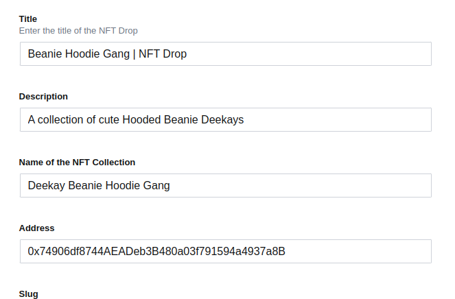
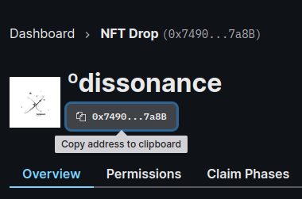

# setup

Here's where I'll be taking y'all through the process
we'll be learning typescript super easily apparently.

Maybe I can collaborate with Wacks to make this an actual drop LMFAO

I fucking ran into this moronic problem again where there's multiple ways to do this.

`npx create-next-app --example with-tailwindcss nft-drop-app`
nvm it's all g

`https://docs.thirdweb.com/react`
SDK that we're using to connect to third-web
metamask login feature allow us to implement this small bit of code, for login/logout functionality.

we're gonna use `yarn` today.
`yarn run dev`

we're gonna barebones it

Sorting TailwindCSS class Auto with Prettier

`npm install -D prettier prettier-plugin-tailwindcss`

`yarn` list all dependencies
`yarn list --depth 0`

`ncu` works with yarn, that's a relief
but we also get to keep the `package.json` file around.
just we have a `yarn.lock`

## **Prettier**

setup `.prettierrc.json` file that tells the project that we use prettier

`npx prettier --check`

> Fogot to run Prettier?

`npx prettier --write pages/`

### Format on Save

added workspace setting

> Default Formatter: Prettier

works, format
now for plugin `prettier-tailwind-css `

```
// prettier.config.js
module.exports = {
  plugins: [require('prettier-plugin-tailwindcss')],
}
```

this was required since I'm using `yarn`

`works`
now that I'm all done let's get back to sonny's vid.

Let's try out commit subjects

> added prettier functionality + tailwind class sorting

wait this thing is formatting even `.md` files
had to add `.prettierignore` where `*.md`

which didn't do anything boy wth

>hello

also this file is outside the prettier thing. oh lord

set it globally and now it works good boi.

anyways

so the slug auto does it..
`/nft-drop-app/pages/nft/[id].tsx`
so this can have anything in the browser's path 
`http://localhost:3000/nft/apes`
shows me the output


we're starting with mobile first.

```
background-image: linear-gradient(120deg, #d4fc79 0%, #96e6a1 100%);
```

`lg:min-h-screen`
this property makes it fullscreen the left side part.

`space-y-2`
in between padding elements

`lg:grid`
on large screen we need grid

don't use strong ig, stick to span.

so when I would resize the window I don't want to let it go smaller than a certain amount.

just added

```body {  min-width:600px; }```
and this sorta fixed it? however it isn't true over at the 600px

**Basic Front-end is done** completely static!!

we're moving onto
### third-web
[thirdweb react // documentation](https://docs.thirdweb.com/react)
```
npm install @thirdweb-dev/react @thirdweb-dev/sdk ethers
```

we're using third web as a higher-order component
but in layman's we're basically wrapping the entire application

once we do the wrapping, we can use thirdweb in the entire application now.

just do that stuff, 
change their `ChainId` -> `Rinkeby`
now we're on rinkeby

`_app.tsx`
```
import '../styles/globals.css'
import type { AppProps } from 'next/app'

import { ChainId, ThirdwebProvider } from '@thirdweb-dev/react'

function MyApp({ Component, pageProps }: AppProps) {
  return (
    <ThirdwebProvider desiredChainId={ChainId.Rinkeby}>
      <Component {...pageProps} />
    </ThirdwebProvider>
  )
}

export default MyApp

```

all I had to do was import 3 components from `@thirdweb-dev/react` as `useAddress, useDisconnect, useMetamask`

had to call them as methods on a variable.
and then just do an arrow `onClick()` function
on the sign-in button

makes it also display what wallet is currently connected

## Day 3
### sanity.io
we're using sanity.io as the backend cms.
`npm install -g @sanity/ci`
`sanity init --coupon sonny2022` - apparently gives you double of everything to use in sanity.

Which is great lol.

Project Name: `nft-drop-app`
create default dataset configuration

Project output path: `sanity`

`blog` saniy template

we're creating a `.env` file for all sensitive content
actually `.env.local` which does not get picked up by git which is interesting because this is how I lost my first password bruh.


```yarn add next-sanity @sanity/image-url```


```yarn add node-env-file```
for processing env files.


Sanity Studio
>React app that connects to the hosted API with all your blog content
`sanity start`
> sanity start fails to compile hence I cannot get the studio up and running.

damn these schema shits complex.
can't fuck anything up.

bruh I had to remove all other instances / mentions for it to work.


### thirdweb
go to [thirdweb dashboard](https://thirdweb.com/dashboard)
apparently they don't take any fees and I own 100% of the contract, I have no idea what's in it for them.

choose `drop` option.
Deploy -> pay using ethereum

> 0.00123934ETH
Deploy proxy ->  is the function
this what it costs rn


```https://rinkeby.etherscan.io/tx/0x5113ff0b8e5b4c3f27a6fbd026ee4312b93234a1a45165b4c7aea9a361c62469```
this is our first ever deploy

I keep adding in assets, so now I had to drop another item
now triggering the smart contract
`lazy mint`
tx
```https://rinkeby.etherscan.io/tx/0xa5f17c0c1e6c0084cca21c2ec0a5f6d45bc3e2d347ed7c737b57c32d4305ee30```

Claim Phases
```https://rinkeby.etherscan.io/tx/0x2e3fd3450d22cb22522a73daeefc1238149de9fa0743b68c85b7d4a2e6689264```

basically I got it.

**Implementing Server Side Rendering**
arrow function `getServerSideProps` destructuring the params
since we're using typescript it gives us valuable feedback

go to sanity studio go to `vision` tab on there

we're using props as we normally would.

Typescript shenanigans


getting 
`Error dataset must be provided to perform queries`
oh yeah in the local env I forgot to add production dataset


basically this shit fucked me over
```token: 'sanity-auth-token',```
this shit apparently needed authentication on every fucking page.


**Building out the homepage**
had to fix sumn else on the `sanity.js`
we finally pulled in the main dissonance image from the sanity backend WOOHOO.

used something like a sticky footer.

**SSR pt 2**

in id we need the slug value

very dynamic route. ez
we get a 404 page that doesn't mess up.

Then converted most of the id elements from static to dynamic.

`urlFor` interesting.

also inspect the `Props`, `interface` and  `getServerSideProps`
these are def things I need to pick up upon.


### Day 4
Create State in React
short term memory

`useState` and `useEffect`
when page loads what am I going to go ahead and execute.

watch `useEffect` tutorial lmfao.
> Side Effects on a functional component

lifecycle methods
components mounts and unmounts.

about to render, after render, receives new props, execute piece of code
this is new and functional programming.

functional component and class based component.

**summary**
useEffect with no array dependency - re-render
useEffect with empty array dependency - component mount
useEffect with non-empty array dependency - unmount.

import `useNFTDrop` from thirdweb

damn the tooling is fucking insane.
auto-imports are fucking welcome as shit.

Unhandled Runtime Error
Error: invalid address (argument="address", value="0x5113ff0b8e5b4c3f27a6fbd026ee4312b93234a1a45165b4c7aea9a361c62469", code=INVALID_ARGUMENT, version=address/5.6.0)
Create State in React
short term memory

`useState` and `useEffect`
when page loads what am I going to go ahead and execute.

watch `useEffect` tutorial lmfao.
> Side Effects on a functional component

lifecycle methods
components mounts and unmounts.

about to render, after render, receives new props, execute piece of code
this is new and functional programming.

functional component and class based component.

**summary**
useEffect with no array dependency - re-render
useEffect with empty array dependency - component mount
useEffect with non-empty array dependency - unmount.

import `useNFTDrop` from thirdweb

damn the tooling is fucking insane.
auto-imports are fucking welcome as shit.

>Unhandled Runtime Error
>Error: invalid address (argument="address", value="0x5113ff0b8e5b4c3f27a6fbd026ee4312b93234a1a45165b4c7aea9a361c62469", code=INVALID_ARGUMENT, version=address/5.6.0)

error stops if I take out `useEffect` inside `NFTDrop`
```      const claimed = await nftDrop.getAllClaimed()```
sumn wrong with this function

basically nftDrop is a huge object which is fucking crazy.

BUT. getAllClaimed() is not working somehow?

maybe I'm not calling `NFTDropPage` properly?
because all functions on that mess up.

i'm supposed to send contract props to it.

the props work just as fine too.
just got obj

```
  console.log('collection' + JSON.stringify(collection))

```
i give up resorting to the discord

turns out the runtime error had some other weird obscure contract name no idea what the fuck.

but I'm sure I only copied what was presented to me LMFAO.
but in sanity studio the address was off so that's why.

once I got it back we were all gucci.


yeah.

### Loading Animation

yeah well just picked up some animation that looks better than the default

also implemented NFT functions.

make the NFT popup, with the attributes so that is apparenty upto us.


## Minting Experience

**mint successful**


we're getting hot toast alert notifications


I minted but the artwork is missing RIP.

here's dissonance chan minted but i can't find the host link
[dissonance-chan minted](https://testnets.opensea.io/assets/0x74906df8744aeadeb3b480a03f791594a4937a8b/0)

another example token
[azuki testnet](https://rinkeby.etherscan.io/address/0xb74bf94049d2c01f8805b8b15db0909168cabf46)


also don't use the trademark º because that shows up as bruh.

click on token
[token metadata json](https://ikzttp.mypinata.cloud/ipfs/QmQFkLSQysj94s5GvTHPyzTxrawwtjgiiYS2TBLgrvw8CW/182)

when you click the token number that shows the ipfs hosted data place.
I think I messed up my shii

there's also the embed code right here
[embed code thirdweb](https://thirdweb.com/dashboard/rinkeby/nft-drop/0x74906df8744AEADeb3B480a03f791594a4937a8B?tabIndex=3)


nvm it fucking works

[ipfs // dissonance-chan](ipfs://QmSA8Q2D78gYCMQzLsMuqcDWQ8apxxuLsu2uY6JidgaVjr/0.png)


wait ipfs links are blocked in india?

eventually became a dweb link?
so I guess it is hosted somewhere?
[dweb ipfs hosted link](https://dweb.link/ipfs/QmdWCanWn4cY7g5nCqfjGmGUz13U48knDd5pyXG5p4XTMs/0)

on brave if we visit `brave://ipfs` we get to change the public gateway address


finally we get dissonance chan after some struggle
[dissonance-chan](https://bafybeibyxsvhwketqcpr7qidl4rqj4qjpdh2bejide5r7k7ti5s5r75wpu.ipfs.dweb.link/0.png)

it does work I have to contact wacks on how to exactly pull this off.

why does the NFT have a pink background gotta check out how it's being hosted on sanity?


now I have to also figure out how to **burn** those tokens as well.

and also how to randomize?

`lsof -i tcp` check what ports are in use
(list open files) -i using internet addresses and ports.